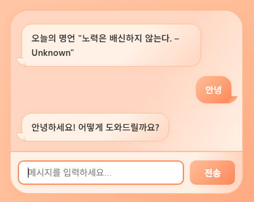

# 바이브 코딩(Vibe Coding)이란?

코딩 지식 없이도 가능, 자연어 기반 개발, AI가 코드 생성

- 프로그래밍 지식이 없어도 누구나 일상 언어로 프로그램을 만들 수 있는 방식
- 기존의 "코드를 직접 작성해야 하는 방식"에서 벗어나, 아이디어만 있으면 개발이 가능한 환경을 제공
- 개발을 전문으로 하지 않는 사람에게 개발 참여의 장벽을 크게 낮춰준 것이 특징

## 실습 과정

1. [Chatgpt API 키 발급](https://openai.com/ko-KR/api/)

2. VS Code의 Copliot 설정
    - 사용 모델: GPT-4.1
    - 사용 모드: Agent

3. Extensions에서 Live Server 설치

4. Copilot에 챗봇 기본 틀 작성 요청
    - Example
        - 웹에서 동작하는 챗봇 프로그램을 만들고 싶어. 사용 언어는 HTML, CSS, JS로 간단한 구조로 파일 생성 해줘.
        - 챗팅이 구분될 수 있도록 텔레그램 스타일로 수정해줘.
        - 지금부터 챗봇의 답변은 ChatGPT의 API의 `gpt-4o-mini` 모델을 사용해줘.
        - API 키는 웹사이트에 들어갔을 때 입력하는 팝업창이 나오도록 해줘.
        - 처음 시작할 때 오늘의 명언을 웰컴 메세지로 출력해줘.
        - 올해의 팬톤 컬러를 컨셉으로 챗팅창을 화려하게 꾸며줘.

5. 실행 결과

